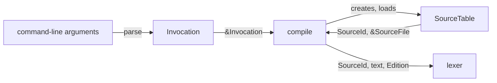

# Compiler Session

A compiler session is the state that one compilation holds and the inputs that reach it. This page states the current session contract of the `fernq` driver. Code review enforces the contract. No mechanical check exists.

## Ownership

A process runs at most one compilation. Help and an invalid command line run none.

The function `compile` in the `driver` module of the `fernq` library, `crates/fernq/src/driver.rs`, owns the compilation. The `fernq` binary only calls the library entry, `fernq::run`. The compilation has:

- one configuration: the `Invocation` that the command-line parser produces. It holds the input path, the output path, the edition, and the input size limit. It does not change after parsing.
- one piece of mutable state: the `SourceTable` that `compile` creates and owns. It holds every source file that the compilation loads.

`compile` loads the input into the `SourceTable`, lexes it to the end of the file or to the first lexical error, and reports one diagnostic. Each stage receives the values it reads as parameters. No value passes through a stage that does not use it. The session is a contract, not a type: no session or context object exists.

## Process Input and Global State

The command-line arguments are the only process input to a compilation. The input file is read through the path that they name. Compilation reads no environment variable.

Fernq keeps no compiler state in global variables.

`fernq::run` installs a panic hook once, before it parses the command line. The hook writes the internal compiler error diagnostic, then runs the previous hook. It holds no compiler state. The previous hook is the default hook of the Rust standard library, which reads `RUST_BACKTRACE`.

## Edition and Target

The edition is configuration. The `Invocation` holds it, and the command line requires it: [Command Line](cli.md) states the accepted values. The lexer is the only stage that reads the edition. `compile` passes it to the lexer as a parameter.

No stage takes a target, and no current outcome depends on one. The command line has no target option: `--target` is an unknown option.

A stage that depends on the edition or the target receives it as an explicit parameter, from configuration that the driver parses. It does not take the edition or the target from the host, the environment, or the source text.

## Limits

- Target input is not defined. It belongs to target support.
- Configuration and mutable state are not split further. A split belongs to the first stage that needs a second piece of mutable state.
