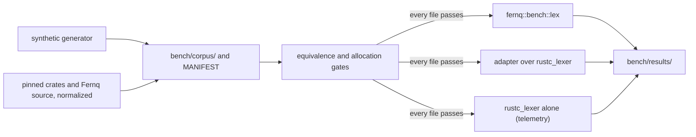

# Lexing Performance

This page describes how Fernq measures its lexer. [Performance](README.md) defines the benchmark model. [Command Line](../cli.md#lexing) owns the supported lexical surface. [CONTRIBUTING.md](../../CONTRIBUTING.md#lexer-benchmark) lists the commands.

Fernq publishes no lexer performance results, and this page contains no measurements. The lexer benchmark produces engineering evidence at the dev and validation tiers. It does not support a public claim.

## Current Lexer

The lexer reads the text of one loaded source file in the edition of that source. The lexer:

- is pull-based: the caller requests each token;
- returns one token per call;
- retains no token collection: the caller decides which tokens to keep;
- stops at end of file, or at the first position outside the supported lexical surface.

The lexer is internal to the `fernq` crate. It is not a public API.

The `fernq` driver lexes the whole input and keeps no token. The time of a complete `fernq` process also includes process start, command-line parsing, input loading, and diagnostic output. It is not a lexer measurement.

## Measurement Entry

The Cargo feature `bench` adds the hidden module `fernq::bench`. The shipped `fernq` binary does not contain it, and it is not an API: it exists for the benchmark in `bench/` and has no stability promise.

| Item | Contract |
|---|---|
| `lex(text, edition)` | Lexes `text` to its end and returns the token count and the `fold` of every token's span and kind, or `None` on a lexical error or an edition other than 2015, 2018, 2021, or 2024. It stores no token. |
| `tokens(text, edition)` | Returns the kind and byte range of each token, or `None` as `lex` does. |
| `TokenKind` | The exact identity of a token: its class (identifier, keyword, raw identifier, lifetime, raw lifetime, each literal class, punctuation, open delimiter, close delimiter) and, for a keyword, a punctuation token, or a delimiter, which one (`Keyword`, `Punctuation`, `Delimiter`). These types belong to the module; the lexer's own token types stay private. |
| `fold(hash, kind, lo, hi)` | Mixes one token's span and kind into a hash. Both timed sides of the comparison fold their tokens with it. |
| `sizes()` | The size in bytes of `Token`, `TokenKind`, `Span`, `LexError`, `LexErrorKind`, `Result<Token, LexError>`, and `Lexer`, the lexer's representation types. |

`lex` allocates nothing. It lexes outside any source table, with a source identity that names no file, and exposes no lexical error. `tokens` allocates only its result.

## Benchmark Harness

`bench/` is a crate outside the workspace, with its own `Cargo.lock`. Its dependencies are development tools and are not part of the compiler.

The harness times three implementations:

| Implementation | Work |
|---|---|
| `fernq` | `fernq::bench::lex`: the Fernq lexer contract, each token folded with its span and exact kind. |
| `adapter` | The equivalence adapter: the same contract, computed over `rustc_lexer`, each token folded with `fernq::bench::fold` as `fernq` folds it. |
| `rustc_lexer-tokenize` | `rustc_lexer` tokenization alone. It does less work than the other two and is telemetry, not a comparison. |

A workload is one synthetic file, one source of the real corpus (`real/<source>`), or the whole real corpus (`real`). A sample is one timed pass over the workload, repeated until the sample covers at least 1 MiB of input; the harness reports the time per pass. Each implementation gets one warm-up sample and 15 timed samples per workload.

| Tier | Runs |
|---|---|
| `dev` | One run. |
| `validation` | Two runs; the second runs the implementations in reversed order. |

A counting allocator records the allocations and bytes allocated on the harness thread during each sample.

Each run writes `bench/results/<UTC time>-<tier>/`:

| File | Content |
|---|---|
| `environment.txt` | Tier, date, Fernq revision, corpus `MANIFEST` hash, build profile, operating system, CPU, memory, `rustc -Vv`, `cargo -V`. |
| `samples.tsv` | Every timed sample. |
| `summary.tsv` | Per run, implementation, and workload: median, minimum, and maximum ns per pass; ns per byte; MB/s; tokens/s; code points/s for the non-ASCII class; allocations and bytes allocated per pass. |
| `sizes.tsv` | The output of `fernq::bench::sizes`. |

For `rustc_lexer-tokenize`, the token count in `summary.tsv` counts `rustc_lexer` tokens, whitespace and comments included.

`fernq-bench --instructions <implementation> <workload> <count> --corpus bench/corpus` lexes one workload `count` times and prints the folded result, for an external instruction counter such as `time -l`.

## Gates

Before any timing, the harness checks every corpus file, in the edition that `MANIFEST` lists:

- Equivalence gate: `fernq::bench::tokens` and the adapter give equal token kinds and byte ranges: the same class and, for keywords, punctuation tokens, and delimiters, the same one. When Fernq ends with a lexical error, the adapter must end with an error too.
- Allocation gate: `fernq::bench::lex` and the adapter make no allocation while they lex the file.

A failed gate stops the run with status 1 before any timing. An equivalence failure names the file and the first differing token; an allocation failure names the file, the implementation, and its allocations.

## Reference Adapter

The adapter runs on `ra-ap-rustc_lexer 0.174.0`, whose source is the `rustc_lexer` of `rustc 1.99.0` (commit `b940084d7`). Its support crates are pinned to the versions that `rustc 1.99.0` locks: `rustc-literal-escaper 0.0.8`, `unicode-ident 1.0.24`, `memchr 2.8.0`, and `unicode-properties 0.1.4` with the features that `rustc_lexer` enables.

The adapter does the work of the Fernq lexer contract:

- removes a byte order mark at offset 0, then a shebang;
- skips whitespace and non-doc comments;
- rejects what the Fernq lexer rejects: doc comments, unterminated block comments, unknown characters, identifiers with emoji, reserved prefixes from edition 2021, guarded string prefixes and `##` from edition 2024, lifetimes that start with a digit, the raw names `_`, `crate`, `self`, `Self`, and `super`, ZWJ and ZWNJ in identifiers, lifetimes, and suffixes, and the suffix `_` alone;
- before edition 2021, splits C strings, prefixed identifiers, and raw lifetimes as the Fernq lexer lexes them;
- validates every literal: escapes and content with `rustc-literal-escaper`, empty integers and exponents, digits outside the radix, and binary or octal floats; CR LF inside a literal is accepted;
- names keywords by edition with a `match`;
- glues adjacent single-character punctuation into the compound punctuation of the Rust Reference with a `match` that names the compound token;
- allocates nothing per token.

The adapter names each token from the `rustc_lexer` token kind and from the two matches above, which its contract needs anyway. It reads no token text only to name a token.

The adapter does not intern or NFC-normalize identifiers, lint bidirectional characters, pair delimiters, or build diagnostics. The `rustc` lexer layer, `rustc_parse::lexer`, does that work, and the Fernq lexer does not. A comparison with the adapter is therefore not a comparison with `rustc`'s lexer layer.

The adapter is frozen. A change to it starts a new comparison with a new baseline: results from different adapter versions are not comparable.

## Corpora

`make bench-corpus` builds `bench/corpus/`, which Git ignores. `MANIFEST` lists every file with its size, SHA-256, edition, source, and label.

### Synthetic Workloads

A seeded `std`-only generator writes ten workload classes at 1 KiB, 10 KiB, 100 KiB, 1 MiB, and 16 MiB, as edition 2024 source that lexes to the end of file. The output depends only on the seed in `bench/src/bin/corpus-gen.rs`: two runs give identical files. The position of a class in the generator selects its random stream; a new class goes last, so the bytes of the existing classes stay the same.

| Class | Content |
|---|---|
| `identifiers` | ASCII identifiers, separated by spaces, commas, and dots |
| `keywords` | strict and reserved keywords of edition 2024 |
| `delimiters` | balanced, nested `()`, `[]`, and `{}` with sparse atoms |
| `whitespace` | runs of spaces, tabs, LF, and CR LF between sparse tokens |
| `line-comments` | indented line comments of about the length of real ones, some `////` comments, and a few short statements |
| `block-comments` | nested and empty block comments |
| `punctuation` | the Reference punctuation tokens, glued or separated by one space |
| `strings` | string, byte string, C string, character, and byte literals with escapes |
| `raw-strings` | raw strings with up to 64 `#`, holding terminator near misses |
| `non-ascii-identifiers` | identifiers of Latin-1, Greek, Cyrillic, CJK, Hangul, and CJK extension B letters in NFC, with some ASCII letters, digits, and `_` |

At 1 KiB and 10 KiB, one sample repeats the same short file many times. These sizes are less stable between runs, and caches and branch predictors see the same input again, so they do not show how cost scales with input size.

### Real Corpus

| Source | Files | Edition | Origin |
|---|---|---|---|
| `syn 2.0.119` | `src/**/*.rs` | 2021 | `static.crates.io`, SHA-256 `872831b642d1a07999a962a351ed35b955ea2cfc8f3862091e2a240a84f17297` |
| `regex-syntax 0.8.8` | `src/**/*.rs` | 2021 | `static.crates.io`, SHA-256 `7a2d987857b319362043e95f5353c0535c1f58eec5336fdfcf626430af7def58` |
| `serde 1.0.229` | `src/**/*.rs` | 2021 | `static.crates.io`, SHA-256 `4148590afebada386688f18773da617792bf2ef03ffc1e4cbd2b1d45b023e0ba` |
| Fernq | `crates/fernq/src`, `crates/fernq/tests` without fixtures, `tools`, `fuzz/fuzz_targets` | 2024 | `git archive` at `FERNQ_CORPUS_REV`, default `5b0b04a` |

Each archive must match its SHA-256 before any archive is extracted. A mismatch stops `make bench-corpus`, and only a verified download is kept in `bench/corpus/download/`.

The real corpus is normalized: doc comments are rewritten as plain comments of the same length (`///` and `//!` to `// `, `/**` and `/*!` to `/* `), because the Fernq lexer reports doc comments as unsupported. Byte offsets are unchanged. Every real file carries the label `normalized` in `MANIFEST`. A measurement on the real corpus measures this normalized text, not the published crates byte for byte.

`make bench-corpus` ends by lexing every corpus file with Fernq in its edition, and fails when one does not reach the end of file.

## Limits

- The benchmark runs on macOS aarch64. The synthetic generator gives identical output on Linux aarch64; the harness is not validated on other hosts.
- The harness measures one component, the lexer. A lexer result does not establish end-to-end compiler performance.
- The adapter's equivalence is checked by the gate on every corpus file. Its efficiency was reviewed, not proven optimal.
